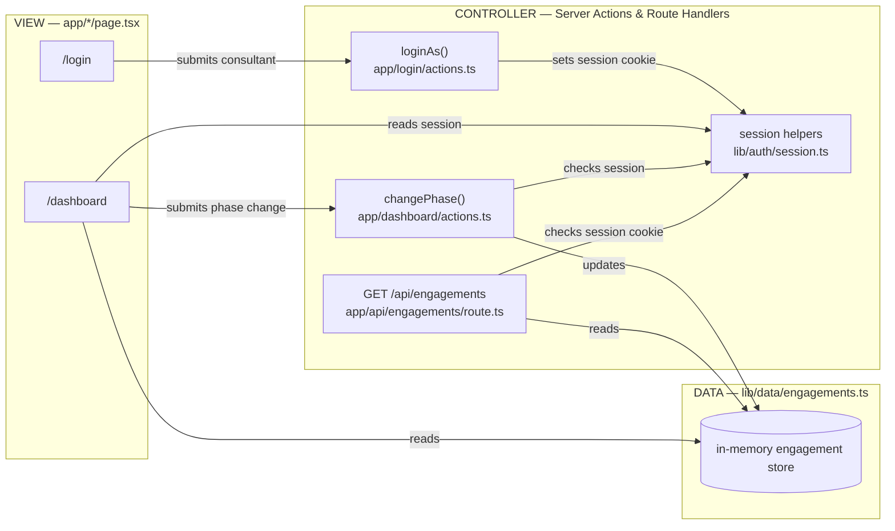

# Architecture: ACT Client Engagement Tracker

## Stack

- **Framework:** Next.js (App Router), TypeScript, Tailwind CSS.
- **Data:** in-memory mock store (`lib/data/engagements.ts`) shaped like a
  real table — a stand-in for Postgres/Supabase so the lab needs no cloud
  setup. See `docs/decisions.md` for why.
- **Auth:** mock cookie-based session (`lib/auth/session.ts`) — a stand-in
  for a real identity provider. See `docs/decisions.md`.

## The three layers (baseline)



**Note:** `lib/data/engagements.ts` stores its state on `globalThis`, not a
plain module variable — Next.js dev (Turbopack) can evaluate a shared
module more than once per process (once for Route Handler bundles, once
for Server Component/Action bundles), and a plain module-level variable
would give each bundle its own copy, causing the dashboard and
`/api/engagements` to silently drift apart. See `docs/troubleshooting.md`.

## Data shape (baseline)

```ts
type Phase = "Discovery" | "Proposal" | "Active" | "On Hold" | "Closed";

type Engagement = {
  id: string;
  clientName: string;
  consultantOwner: string;
  phase: Phase;
  phaseUpdatedAt: string; // ISO 8601
};
```

There is no `phaseHistory` field yet — that is the lab's Architecture
decision to make.

## Open architecture decision — phase-change history (this lab)

Before writing code, answer (and record here):

- What does the extended `Engagement` type look like — a `phaseHistory`
  array on the engagement, or a separate `PhaseHistoryEntry[]` store keyed
  by engagement id?
- Which layers change?
  - **View:** dashboard needs a note input and a way to show history.
  - **Controller:** `changePhase` (or a new action) needs to accept and
    validate a note.
  - **Data:** the store needs to persist history entries alongside the
    phase update.
- What's the smallest slice that satisfies `docs/PRD.md` §7 without
  touching login, unrelated engagements, or the API route's shape more
  than necessary?

_TODO — fill in after the Architecture prompt in `training/PROMPTS.md`,
before implementation._
